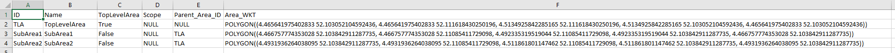
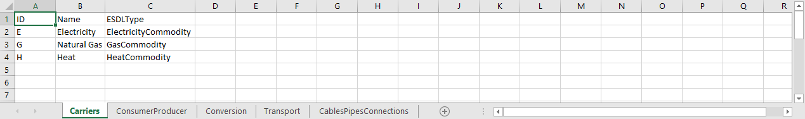
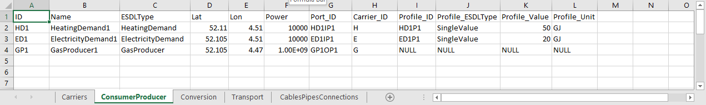
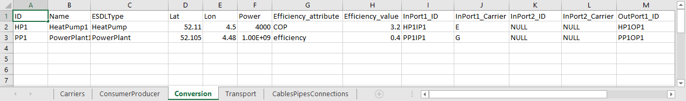
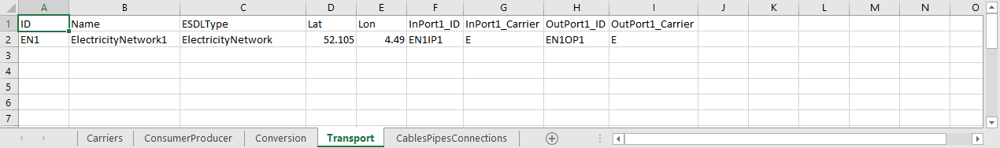
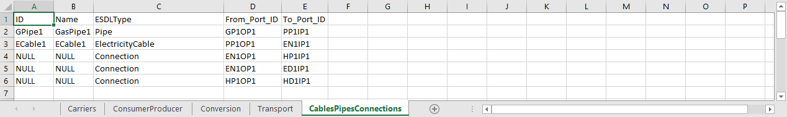
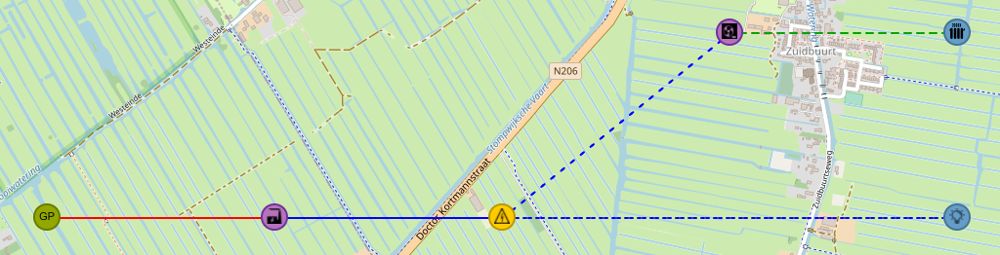
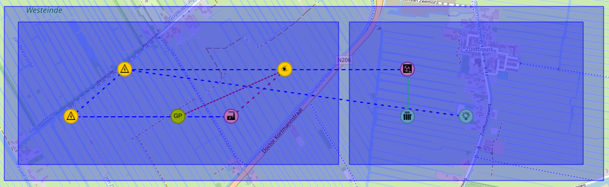

Create ESDL from Excel
======================

This is an example implementation that shows how to build up an ESDL network description based on input coming from an Excel file

Install dependencies
```
pip install -r requirements.txt
```

Run script
```
python main.py
```

Excel contents
--------------

The example Excel files have seven tabs:

1. Areas

   This tab is only filled with information in the second example.

   

   This tab defines the Areas that will be added to the EnergySystem description.

   | Column | Description |
   | --- | ---|
   | ID | The ID of the Area |
   | Name | The name of the Area |
   | TopLevelArea | Whether or not this Area is the top level area in the ESDL (True or False, there can only be one top level area) |
   | Scope | (Optional) ESDL Scope of the Area |
   | Parent_Area_ID | ID of the parent area this Area belongs to |
   | Area_WKT | (Optional) Well Known Text representation of the geometry of the Area |

2. Buildings

   This tab defines the Buildings that will be added to the EnergySystem description.

   | Column | Description |
   | --- | ---|
   | ID | The ID of the Building |
   | Name | The name of the Building |
   | ESDLType | The ESDL class name of the Building, must be a subclass of esdl.AbstractBuilding |
   | Lat | (Optional) The lattitude of the location of the Building asset |
   | Lon | (Optional) The longitude of the location of the Building asset |
   | Parent_Area_ID | ID of the area this Building will be added to |

3. Carriers

   

   This tab defines the Commodities and Carriers that will be added to the EnergySystem description.

   | Column | Description |
   | --- | ---|
   | ID | The ID of the Carrier or Commodity |
   | Name | The name of the Carrier or Commodity |
   | ESDLType | The ESDL class name of the Carrier or Commodity |


4. ConsumerProducer

   

   This tab defines the Consumer and Producer assets that will be added to the EnergySystem description. Consumers are
   added with one InPort, Producers with on OutPort.

   | Column | Description |
   | --- | ---|
   | ID | The ID of the Consumer or Producer asset |
   | Name | The name of the Consumer or Producer asset |
   | ESDLType | The ESDL class name of the Consumer or Producer asset |
   | Lat | (Optional) The lattitude of the location of the Consumer or Producer asset |
   | Lon | (Optional) The longitude of the location of the Consumer or Producer asset |
   | AreaBld_ID | (Optional) The ID of the Area or Building the Consumer or Producer asset will be added to |
   | Power | The power in Watts of the Consumer or Producer asset |
   | Port_ID | The ID of the InPort of the Consumer or the OutPort of the Producer |
   | Carrier_ID | The ID of the carrier that is attached to the Port (see Carriers tab for available Carriers) |
   | Profile_ID | The ID of the profile that is attached to the Port |
   | Profile_ESDLType | Type of the profile that is attached to the Port (currently only SingleValue is supported) |
   | Profile_Value | Value of the profile that is attached to the Port |
   | Profile_Unit | Unit of th value of the profile that is attached to the Port |

5. Conversion

   

   This tab defines the Conversion assets that will be added to the EnergySystem description. Conversion assets can 
   have one or two InPorts and one or two OutPorts.

   | Column | Description |
   | --- | ---|
   | ID | The ID of the Conversion asset |
   | Name | The name of the Conversion asset |
   | ESDLType | The ESDL class name of the Conversion asset |
   | Lat | (Optional) The lattitude of the location of the Conversion asset |
   | Lon | (Optional) The longitude of the location of the Conversion asset |
   | AreaBld_ID | (Optional) The ID of the Area or Building the Conversion asset will be added to |
   | Power | The power in Watts of the Conversion asset |
   | Efficiency_attribute | The name of the attribute that describes the efficiency of the Conversion asset |
   | Efficiency_value | The efficiency value of the Conversion asset |
   | InPort1_ID | The ID of the first InPort of the Conversion asset |
   | InPort1_Carrier | The ID of the carrier of the first InPort of the Conversion asset |
   | InPort2_ID | The ID of the second InPort of the Conversion asset |
   | InPort2_Carrier | The ID of the carrier of the second InPort of the Conversion asset |
   | OutPort1_ID | The ID of the first OutPort of the Conversion asset |
   | OutPort1_Carrier | The ID of the carrier of the first OutPort of the Conversion asset |
   | OutPort2_ID | The ID of the second OutPort of the Conversion asset |
   | OutPort2_Carrier | The ID of the carrier of the second OutPort of the Conversion asset |

6. Transport

   

   This tab is the first tab that defines (part of) the Transport assets that will be added to the EnergySystem
   description. Use this tab for assets like ElectricityNetwork, GasNetwork and so on, if you want them to be
   represented on the map as a Marker icon. Another good example is the Joint asset, that can optionally be used to
   connect cables and or pipes together. These transport assets are added with one InPort and one OutPort.

   | Column | Description |
   | --- | ---|
   | ID | The ID of the Transport asset |
   | Name | The name of the Transport asset |
   | ESDLType | The ESDL class name of the Transport asset |
   | Lat | (Optional) The lattitude of the location of the Transport asset |
   | Lon | (Optional) The longitude of the location of the Transport asset |
   | AreaBld_ID | (Optional) The ID of the Area or Building the Transport asset will be added to |
   | InPort1_ID | The ID of the InPort of the Transport asset |
   | InPort1_Carrier | The ID of the carrier of the InPort of the Transport asset |
   | OutPort1_ID | The ID of the OutPort of the Transport asset |
   | OutPort1_Carrier | The ID of the carrier of the OutPort of the Transport asset |

7. CablesPipesConnections

   

   This tab is the second tab that defines Transport assets and (logical) connections between assets that will be
   added to the EnergySystem description. Use this tab for ElectricityCables and Pipes, if you want them to be
   represented on the map as a Line between two locations. 'Connection' is a special type that can be entered as a
   value in the ESDLType column. Connections only have two values in the columns From_Port_ID and To_Port_ID.
   
   | Column | Description |
   | --- | ---|
   | ID | The ID of the Transport asset |
   | Name | The name of the Transport asset |
   | ESDLType | The ESDL class name of the Transport asset or 'Connection' |
   | AreaBld_ID | (Optional) The ID of the Area or Building the Cable or Pipe will be added to |
   | From_Port_ID | The ID of the port of the first asset that will be connected |
   | To_Port_ID | The ID of the port of the second asset that will be connected |

Examples
========

Simple Energy System
--------------------

The script generates an ESDL file with the name 'example_generated_network.esdl' based on the excel input file with the name 'infrastructure.xlsx'

The ESDL output, when loaded into the ESDL MapEditor, looks like this:



Each commodity/carrier gets its own color:
- Electricity: blue
- Natural Gas: red
- Heat: green

The following assets are shown:
- GasProducer
- Pipe that connects the GasProducer with the PowerPlant (red solid line)
- PowerPlant
- ElectricityCable that connects the PowerPlant to the ElectricityNetwork (blue solid line)
- ElectricityNetwork 
- HeatPump, logically connected to the ElectricityNetwork (blue dashed line)
- HeatingDemand, logically connected to the HeatPump (green dashed line)
- ElectricityDemand, logically connected to the ElectricityNetwork (blue dashed line)

Simple Energy System (with Areas)
---------------------------------

The script generates an ESDL file with the name 'example_generated_network_2.esdl' based on the excel input file with the name 'infrastructure_2.xlsx'

This second example uses Areas with polygons to 'organize' the assets. The assets itself don't have coordinates anymore. When this ESDL is loaded in the ESDL MapEditor,
the MapEditor uses the knowledge that an asset is in a certain area, to assign a random coordinate within the area geometry to this asset.

The ESDL output, when loaded into the ESDL MapEditor, looks like this:

